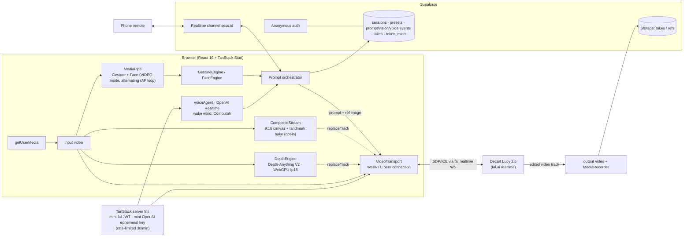

# ⚡ ZAP·LIVE

**Your webcam is the timeline.** A realtime AI video editor that repaints every frame of your live camera feed in under a second — driven by prompts, voice, hand gestures, facial expressions, reference images, depth maps, and a phone remote.

Built on [Decart Lucy 2.5](https://fal.ai/models/decart/lucy-2-5/realtime) realtime video-to-video over WebRTC, with [MediaPipe](https://ai.google.dev/edge/mediapipe) vision running fully in-browser and an OpenAI Realtime voice agent named **Computah**.

> 🔗 Repo: [gratitude5dee/live](https://github.com/gratitude5dee/live) · Powered by [WZRD.tech](https://wzrd.tech)

---

## What it does

Point your camera at yourself and speak: *"Computah, turn me into an anime character."* Lucy restyles the live stream while it keeps playing. Throw a 👍 to commit a typed prompt, ✌️ to cycle presets, open your palm to reset. Drop your jaw and confetti rains for four seconds, then the scene reverts. Toggle depth mode and Lucy paints on a live Depth-Anything map of your body instead of RGB. Scan a QR code and a friend drives the whole show from their phone.

Every take is auto-recorded, saved to your library, and downloadable — sessions run 90 seconds and end with a shareable clip.

## Control planes

| Plane | Input | How it works |
|---|---|---|
| 💬 **Text** | Prompt dock + Space to apply | Prompt sent over Lucy's realtime WS; optional server-side prompt expansion |
| 🗣 **Voice** | Wake word "Computah" | OpenAI Realtime (WebRTC mic, text-only output) classifies into 7 edit types, fills a Lucy-templated prompt, dispatched with **early partial-JSON parsing** (~200–400 ms saved) |
| ✋ **Gestures** | MediaPipe Gesture Recognizer | 👍 commit · 👎 undo · ✌️ next preset · ✊ snapshot · 🖐 hold-to-clear · 🤟 reactive mode · ☝️ HUD toggle |
| 😮 **Face** | MediaPipe blendshapes | `jawOpen` → confetti, `browInnerUp` → sparkles; 4 s auto-revert. No face for 3 s → outbound stream pauses |
| 🎴 **Presets** | Supabase `presets` table | One-tap styled prompts + character swaps with baked reference images; keyboard 1–0 |
| 🖼 **Templates** | Object add-in / Try-on / Replace | Deterministic client-side prompt builder + reference image upload |
| 🌊 **Depth** | Depth Anything V2 (WebGPU) | Grayscale depth stream hot-swapped into Lucy's inbound track via `replaceTrack()` — no SDP renegotiation |
| 📱 **Remote** | QR → `/remote/$sessionId` | Supabase Realtime broadcast: prompts, presets, undo/clear from a second device, with host heartbeat + live vision ticker |

## Architecture



**Latency engineering highlights**

- Prompts fire on the signaling WebSocket *before* React state updates or logging — every ms counts.
- Voice tool-call args are parsed from **streaming JSON deltas** and dispatched before the model finishes the turn; voice prompts skip Lucy's server-side expansion entirely.
- Outbound source (raw camera / landmark composite / depth map) is hot-swapped with `RTCRtpSender.replaceTrack()` — zero renegotiation.
- The landmark compositor is **lazy**: built only when a Character-Swap / Gesture-FX preset opts in, torn down otherwise so clean prompts send the raw 1080p track.
- MediaPipe inference is a single rAF loop that alternates gesture/face graphs and **auto-degrades** its rate when frame time slips (perf mode).
- Depth engine waits for its first real inference frame before swapping tracks, so Lucy never freezes on a black canvas.
- No-face detection pauses outbound frames (privacy + GPU credits); tab hidden > 60 s does the same.

## Stack

| Layer | Tech |
|---|---|
| Framework | React 19 · TanStack Start (SSR) · TanStack Router · Vite · Bun |
| Styling | Tailwind CSS v4 · shadcn/ui (Radix) · custom reactbits (OGL/Three.js/GSAP) |
| AI video | Decart Lucy 2.5 realtime via `@fal-ai/client` (WebRTC) |
| Vision | `@mediapipe/tasks-vision` (Gesture Recognizer + Face Landmarker, GPU delegate) |
| Depth | `@huggingface/transformers` — `onnx-community/depth-anything-v2-small`, WebGPU fp16 |
| Voice | OpenAI Realtime (`gpt-realtime`) over WebRTC data channel, ephemeral client secrets |
| Backend | Supabase — anon auth, Postgres + RLS, Realtime broadcast, Storage |
| Deploy | Nitro (Cloudflare target) via Lovable |

## Getting started

```bash
bun install
cp .env.example .env   # or edit .env
bun dev                # vite dev
```

**Client env (`.env`)**

```
VITE_SUPABASE_URL=…
VITE_SUPABASE_PUBLISHABLE_KEY=…
VITE_SUPABASE_PROJECT_ID=…
```

**Server env (never shipped to the browser)**

```
FAL_KEY=…                  # mints 120s realtime JWTs, decart/lucy-2-5/* only
OPENAI_API_KEY=…           # mints ephemeral Realtime client secrets
OPENAI_REALTIME_MODEL=gpt-realtime   # optional override
```

**Supabase setup**

1. Apply `supabase/migrations/*.sql` (schema, RLS, seed presets, storage policies for `takes` + `refs` buckets).
2. Enable **anonymous sign-ins** (Auth → Providers).
3. Create public storage buckets `takes` and `refs` if the migration didn't.

Then open the app, hit **Enter the stage**, allow the camera, and you're live. HTTPS (or localhost) is required for camera/mic/WebRTC.

## Keyboard & gesture reference

| Key | Action | | Gesture | Action |
|---|---|---|---|---|
| `Space` | Apply typed prompt | | 👍 Thumb up | Commit prompt |
| `Z` | Undo | | 👎 Thumb down | Undo |
| `R` | Record toggle | | ✌️ Victory | Next preset |
| `H`/`V` | HUD toggle | | 🖐 Open palm (hold) | Clear |
| `1–0` | Presets | | ✊ Fist | Snapshot |
| | | | 🤟 ILY | Reactive face mode |
| | | | ☝️ Point up | HUD toggle |

## Voice: Computah

Say **"Computah"** + your edit. The agent is a silent router — it never speaks, only calls tools:

- `apply_video_edit(edit_type, lucy_prompt, use_reference_image)` — 7 edit types: character transformation, add/replace/remove object, change attribute, change background, restyle.
- `wait_for_user()` — anything that isn't a wake-word command.

Wake-word matching is deliberately permissive (`computer`, `kompyoota`, `come pooter`…), with a client-side regex safety net that toasts when Whisper heard you but the router missed. All voice edits land in `voice_events` with latency telemetry.

## Data model

`sessions` → `prompt_events` · `vision_events` · `voice_events` · `takes` (all RLS-scoped per user, timestamped `at_ms` from session start — a full edit timeline for replay/analytics). `presets` supports global rows (`user_id null`) + user-saved presets, thumbnails, reference images, and `template_key` routing (`character_swap`, `gesture_fx`, templates). `token_mints` backs the shared 30/min mint rate limit.

## Project layout

```
src/
  routes/index.tsx          # stage orchestrator (session, engines, transport)
  routes/remote.$sessionId  # phone remote
  routes/library.tsx        # takes gallery
  components/zap/stage/     # DesktopStage · MobileStage (shared props contract)
  lib/zap/
    fal-transport.ts        # Lucy WebRTC + signaling
    depth-engine.ts         # WebGPU depth → MediaStream
    composite-stream.ts     # canvas compositor (9:16, landmark bake)
    gesture-engine.ts       # debounced gesture → action FSM
    face-engine.ts          # blendshape triggers + presence
    voice-agent.ts          # OpenAI Realtime wrapper (early dispatch)
    voice-intent.ts         # Computah instructions, tools, wake regex
    prompt-templates.ts     # deterministic Lucy prompt builders
  lib/*-token.functions.ts  # server fns: fal JWT / OpenAI ephemeral key
supabase/migrations/        # schema + RLS + seed presets
```

## License & credits

Lucy 2.5 by [Decart](https://decart.ai) via [fal.ai](https://fal.ai) · MediaPipe by Google · Depth Anything V2 via 🤗 Transformers.js · Built with [Lovable](https://lovable.dev).
